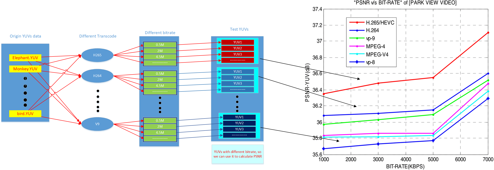
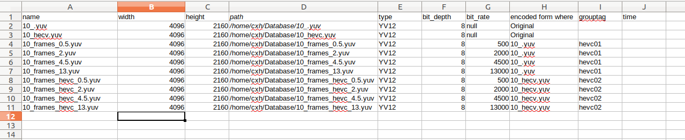

YCbCr (YUV)
===========

Tools for various operations on raw YCbCr video files.
http://en.wikipedia.org/wiki/YCbCr

### ycbcr.py - is the main class that supports the following formats:

* IYUV
* UYVY
* YV12
* NV12
* YVYU
* YUY2
* 422

### **Supported operations**
* PSNR calculations, during different Bitrates YUV files
* multi inputfile according excel configture file

### **Flowchart**

### **purpose**: show Transcode quality 

### **Install direction**
#### sudo apt update
       `sudo apt upgrade`
       `#installing python 2.7 and pip for it`
       `sudo apt install python2.7 python-pip`
       `pip install numpy`
       `pip install <other missing moduel>`

### Usage
-----
	$ ./visual.py -I /home/cxh/code/yuv-tools/testauto.xls 
      -P 10_frames_8k10hevc_Origin.yuv 10_frames_Origin.yuv -G 8k10hevc 264

-----

### **usage:** 
       visual.py [-h] [-I [INPUTPATH]] 
                 [-pi INPUT_TEST [INPUT_TEST ...]]
                 [-W WIDTH] [-H HEIGHT]
                 [-C {IYUV,UYVY,YV12,YVYU,YUY2,422}]
                 [-M BIT_RATE [BIT_RATE ...]]
                 [-G GROUPTAP [GROUPTAP ...]]

      optional arguments:
                 -h, --help   show this help message and exit
                 -I [INPUTPATH]   the excel configure file path
                 -pi INPUT_TEST [INPUT_TEST ...]
                     the Original yuv file name, you can put plenty,and
                  separate by space
                 -W WIDTH,           width
                 -H HEIGHT,          height
                 -C  {IYUV,UYVY,YV12,YVYU,YUY2,422}, 
                     yuv_format_in {IYUV,UYVY,YV12,YVYU,YUY2,422} type
                 -M BIT_RATE [BIT_RATE ...]
                     bitrate with compare yuv
                 -G  --grouptag GROUPTAP [GROUPTAP ...]
                     this tag named a bunch of test yuv files,
                     normally it will be encode from Original yuv
                     but with different bitrate.
-----

Screenshots

#### you have to config your own testsheet.xlsx

refill the yuv file names and it's path, encode from where, bitrate  , grouptag, and so on

using the command line above, -P means you can put every Original yuv files , and same time -G means you choose the test group, which is compare with Original yuv files one by on.

-----------

Here's one of the output from visual.py

